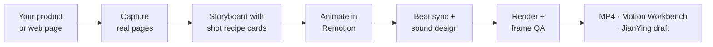

<div align="center">

<picture>
  <source media="(prefers-color-scheme: dark)" srcset="./assets/brand/logo-mark-reverse.svg">
  <source media="(prefers-color-scheme: light)" srcset="./assets/brand/logo-mark.svg">
  
</picture>

# video-shotcraft

**Frame motion. Craft the shot.**

Point your agent at your product. Get a cinematic promo film back.


[**▶ Browse all 150 shots in the Gallery**](https://vincentwei1021.github.io/video-shotcraft/) · [**🎬 Watch the Showcase**](https://vincentwei1021.github.io/video-shotcraft/showcase.html)

**English** | [中文](README_CN.md) | [日本語](README_JA.md)

[](https://github.com/Vincentwei1021/video-shotcraft/stargazers)
[](LICENSE)
[](SKILL.md)
[](SKILL.md)
[](https://atomgit.com/VincentWei/video-shotcraft)

<a href="https://trendshift.io/repositories/88911?utm_source=trendshift-badge&utm_medium=badge&utm_campaign=badge-trendshift-88911" target="_blank" rel="noopener noreferrer"></a>

</div>

## What it does

Tell Claude Code or Codex "make a promo for my product". The agent captures your real pages, picks shots
from a library of tuned motion recipes, storyboards the film, animates it with
[Remotion](https://www.remotion.dev/), cuts it to the beat, adds sound design, checks every frame and hands you
a finished MP4 you can keep editing.

It is not a video generator. Every frame is drawn by code from your own screenshots and copy, so the result is
sharp, on-brand and fully editable.

- **Real product, real pages.** Your actual UI, captured and moved with 2.5D camera work, not a generated look-alike.
- **124 shot recipe cards, 150 tuned shots.** Each card says when to use the shot, its timing, easing and known
  pitfalls, and ships a Remotion implementation you can read.
- **A finished film, not a clip.** Storyboard, captions, beat-synced cuts, film-grade SFX and a final QA pass,
  then a browser workbench and a JianYing (CapCut CN) export to keep editing.

**How it works**



## What's new

> [!IMPORTANT]
> ### 🎬 2026-10 · Library overhaul: every shot re-crafted, the best version kept
> All 216 demo shots went through two redesign passes: a texture polish, and a
> full launch-film-grade redesign built on a new visual system
> (`demos/_fixtures/Look.tsx`: 8 lit stage looks, a type scale, text reveals,
> light and grain). Every shot was then reviewed side by side (original /
> polish / redesign) and the strongest version kept: 92 redesigns, 50 polished,
> 8 originals. 66 weaker shots were retired, so the library is now
> **124 cards / 150 shots**, all freshly re-rendered in the Gallery.
>
> The demos now star video-shotcraft itself: its Frame Chisel mark, wordmark
> and promo copy. The mark and name come from one shared file,
> `demos/_fixtures/Brand.tsx`; when the skill builds your film, the agent swaps
> in your logo and rewrites the copy for your product.

- **2026-09 · [Motion Workbench](#motion-workbench).** Keep editing the delivered film in a CapCut-style browser editor.
- **2026-09 · One-click film themes.** Switch the template between nine looks (Ink Press, Modern Light, Midnight,
  Sage, Coral, Iris, Deep Ocean, Obsidian Violet, Vintage Kraft) and keep your edits. [Theme guide](template/THEMES.md).
- **2026-08 · [video-talkcraft](https://github.com/Vincentwei1021/video-talkcraft)**, the narration-video
  sibling: script + voiceover in, every motion beat locked to the voice
  ([78 narration previews](https://vincentwei1021.github.io/video-talkcraft/)).
- **2026-08 · JianYing (CapCut CN) export.** The final film becomes an editable JianYing draft: per-shot clips,
  native caption tracks, separate SFX/BGM tracks. Verified on JianYing Pro 11.2 for macOS
  ([guide](references/jianying-export.md)).
- **2026-08 · 48 new shot recipe cards**, distilled through eight rounds of frame-by-frame review against
  reference footage ([sourcing notes](references/shots/ATTRIBUTION.md)).

## Install

Built and tuned for Claude Code and Codex. The simplest way is to hand your agent the link:

```text
Install this skill for me: https://github.com/Vincentwei1021/video-shotcraft
```

Or with the [skills](https://skills.sh/) CLI:

```bash
npx skills add Vincentwei1021/video-shotcraft
```

Or by hand:

```bash
git clone https://github.com/Vincentwei1021/video-shotcraft.git
cd video-shotcraft
ln -s "$(pwd)" ~/.claude/skills/video-shotcraft   # Claude Code
ln -s "$(pwd)" ~/.codex/skills/video-shotcraft    # Codex
```

In mainland China, clone from the AtomGit mirror if GitHub is slow:
`git clone https://atomgit.com/VincentWei/video-shotcraft.git`.

## Use

Just describe the film. No command needed.

| Say | What happens |
|---|---|
| `Use video-shotcraft to make a promo for my product.` | The agent introduces the Ink Press template and asks whether to use it, then captures your pages and builds the film |
| `Make a launch film for this repo with the Ink Press template.` | The fastest path: your screenshots, copy and logo dropped into a validated template |
| `Use the deck-deal-flyin and row-embed shot cards to present this feature.` | You pick the shots by name (copy names straight from the Gallery) |
| `Design a product close-up inspired by spotlight-hero-card.` | One shot, adapted to your product |

## What you get

| Output | Details |
|---|---|
| Final film | `MP4`, 1920×1080, 30 fps, h264, with music and sound design |
| Remotion project | The full source of your film: every shot is a React component you or the agent can change |
| Motion Workbench | Opens after delivery: tracks, inspector, retime, swap shots, export ([details](#motion-workbench)) |
| JianYing draft | Optional: an editable JianYing (CapCut CN) project with per-shot clips, captions and audio tracks |

Also in the box: reusable Remotion components (2.5D page camera, captions, flash cuts, digit rolls), 149 SFX and
5 BGM tracks, page-capture scripts, and the production method itself (capture, visual direction, storyboarding,
sound design, beat sync, final QA) in [references/](references/pipeline.md).

## Shot library

124 recipe cards in 10 categories, 150 shots in total. Search, filter and copy card names in the
[Gallery](https://vincentwei1021.github.io/video-shotcraft/).

<table>
<tr>
<td align="center" width="50%"><b>Opening & Brand</b> · 11 shots<br><br><sub>text-as-mask: the product shows through the title</sub></td>
<td align="center" width="50%"><b>Camera</b> · 13 shots<br><br><sub>exploded-view: the page tilts and comes apart</sub></td>
</tr>
<tr>
<td align="center" width="50%"><b>Transitions</b> · 19 shots<br><br><sub>card-flock-tumble: a flock of cards becomes the headline</sub></td>
<td align="center" width="50%"><b>Typography</b> · 25 shots<br><br><sub>flying-words: a word tunnel resolves into the motto</sub></td>
</tr>
<tr>
<td align="center" width="50%"><b>UI Entrance</b> · 22 shots<br><br><sub>card-stack: a fan of cards deals into place</sub></td>
<td align="center" width="50%"><b>Interaction</b> · 13 shots<br><br><sub>palette-theme-ripple: a new theme ripples across the UI</sub></td>
</tr>
<tr>
<td align="center" width="50%"><b>Data</b> · 9 shots<br><br><sub>axis-rescale-shock: the spike breaks the axis</sub></td>
<td align="center" width="50%"><b>Light & Emphasis</b> · 23 shots<br><br><sub>spotlight-sweep: a stage light finds the title</sub></td>
</tr>
<tr>
<td align="center" width="50%"><b>Rhythm</b> · 8 shots<br><br><sub>paparazzi-flash: three flashes, three crops, one number</sub></td>
<td align="center" width="50%"><b>Outro</b> · 7 shots<br><br><sub>input-morph-assemble: the chat box builds the logo</sub></td>
</tr>
</table>

Each card lives in `references/shots/<category>/<card>.md`, with its Remotion implementation in
`demos/<category>/<card>/` (see [demos/README.md](demos/README.md) for how to wire one into your project).

## Video template: Ink Press

A validated, complete promo: 36.2 seconds, 1920×1080, 30 fps, 10 shots in a paper, ink and amber style, with
2.5D real-page camera moves, title cards, transitions and a fully pinned cinematic SFX pass.

https://github.com/user-attachments/assets/4cf5af51-98f3-4af2-8ab2-7267f470513d

▶️ [Watch in HD on YouTube](https://youtu.be/iShab28B_ak)

Say `Use video-shotcraft to make a promo for my product with the Ink Press template.` The agent swaps in your
screenshots, copy and branding. It is the fastest, most reliable path to a finished film. More templates are on
the way.

## Motion Workbench

After delivery the skill opens a CapCut-style editor in your browser
(`node workbench/scripts/open.mjs <project>`). The film is split into shot, transition, caption and SFX tracks
exactly as authored. Select any shot to edit its copy, font sizes and colours, move, trim or speed-ramp clips,
drag in any of the 150 library shots, then export with Remotion. Preview and render are frame-identical.


[Workbench guide, every panel with screenshots](workbench/GUIDE.md) (Chinese) ·
[Integration contract](references/workbench.md)

## Showcase

The 38-second Gallery intro below was itself made with this skill: storyboard, shots and sound design were all
done by an agent following the library's method.

https://github.com/user-attachments/assets/cba2df8a-4b2e-4247-bace-d0b1dea9c2bd

▶️ [Watch in HD on YouTube](https://youtu.be/gcVvRM_P3SM)

**Share your film.** Made something with video-shotcraft?
[Submit it](https://github.com/Vincentwei1021/video-shotcraft/issues/new?template=showcase.yml) with the
Showcase issue form. After review it appears on the
[Showcase page](https://vincentwei1021.github.io/video-shotcraft/showcase.html).

## Requirements

| Needs | For |
|---|---|
| Node.js and npm | Remotion rendering, the template and the workbench |
| ffmpeg / ffprobe | Frame checks and final QA |
| [uv](https://docs.astral.sh/uv/) | Only for BGM beat analysis (runs a one-off Python script) |
| puppeteer | Only for page capture; the capture script installs it on demand |

Remotion downloads its own headless Chrome on first render. Tested on macOS; Linux works with the notes below.

<details>
<summary><b>Headless Linux / CI notes</b></summary>

Rendering on a headless Linux box (tested: 2 cores, Node 22) hits three walls:

1. **Concurrency cap.** `remotion still/render` fails with "Maximum for --concurrency is 2" on low-core
   machines. Pass `--concurrency=1`.
2. **Old headless removal.** Recent Chrome/Chromium dropped the old headless mode, so pointing Remotion at
   system Chromium fails to launch. Use a chrome-headless-shell binary instead of full Chrome.
3. **Blocked CDN.** If remotion.media is unreachable (common in mainland China), the automatic headless-shell
   download fails. Pass `--browser-executable=<path-to-local chrome-headless-shell>`.

With these three flags, frame renders from the bundled template work.

</details>

<details>
<summary><b>Repository structure</b></summary>

```text
video-shotcraft/
├── SKILL.md                 # Agent entry point and core production rules
├── references/
│   ├── pipeline.md          # End-to-end production workflow
│   ├── shots/               # 124 shot recipe cards in 10 functional categories
│   ├── sequences/           # Reusable full-video structures and sequence patterns
│   ├── aesthetic-rules.md   # Visual QA criteria
│   ├── music-beat-sync.md   # BGM analysis and beat-sync methodology
│   ├── sound-design.md      # Sound-design guidance and examples
│   ├── jianying-export.md   # JianYing (CapCut CN) project-export guide
│   └── workbench.md         # Motion workbench: manifest contract + editability rules
├── demos/                   # Remotion reference implementations (same categories)
├── gallery/                 # Static motion-preview Gallery
├── template/                # Runnable complete video template
├── jianying-export/         # JianYing draft installers (mac tested / win untested)
├── workbench/               # Post-delivery motion workbench (Vite + Remotion Player)
└── assets/
    ├── lib/                 # Reusable Remotion components
    ├── scripts/             # Page-asset capture scripts
    └── audio/               # Audio assets
        ├── bgm/             # 5 BGM options
        └── sfx/<category>/  # 149 SFX across 16 scene categories
```

For the full workflow see [SKILL.md](SKILL.md), the [production pipeline](references/pipeline.md) and the
[visual QA criteria](references/aesthetic-rules.md).

</details>

## Audio and assets

SFX are organized into 16 scene and material categories (`transition` `impact` `riser` `camera` `ui` `text`
`paper` `film` `light` `data` `scifi` `mech` `glass` `fluid` `crowd` `counter`): pick the category first, then
the timbre. See [sound-design.md](references/sound-design.md) for the index and per-file usage, and
[ATTRIBUTION.md](assets/audio/ATTRIBUTION.md) for sources and licenses.

Product screenshots bundled with the template are demonstration assets. Replace them with screenshots of your
product before publishing, and check whether any product, customer or personal data needs to be anonymized.

## License

- Code and docs: [Apache-2.0](LICENSE).
- Audio under `assets/audio/`: each file under its own license, see [ATTRIBUTION.md](assets/audio/ATTRIBUTION.md).
- [Remotion](https://www.remotion.dev/) has its own
  [license](https://github.com/remotion-dev/remotion/blob/main/LICENSE.md): free for individuals and small
  teams, companies may need a paid license.

## Acknowledgements

Many recipes were distilled by studying the motion language of outstanding official product films, including
promos from **ClickUp, Perplexity, Slack, Notion, Figma, Framer, Bear, Raycast, Pitch, Miro, Superhuman and
Loom**. The cards document techniques (timing, easing, choreography) re-implemented from scratch; no footage,
artwork or brand assets from these films are included. All trademarks belong to their owners, and none of these
companies are affiliated with or endorse this project.

Thanks also to **[Remotion](https://www.remotion.dev/)**, which powers every demo and template here;
**[Mixkit](https://mixkit.co/)**, the source of the bundled SFX and music under its free license; the game-feel
and animation communities whose published principles inform several cards; and **Claude Code**, with which this
library was built, iterated and QA'd using the same workflow the skill teaches.

## Follow me

<p>
  <a href="https://x.com/VincentWei93"></a>
  <a href="https://www.douyin.com/user/MS4wLjABAAAAK1pkjBxilk2Oi_9h_vFyD-lTAu9CTlvhmOtkosDvvxg"></a>
  <a href="https://xhslink.cn/m/At9iP2d5C1V"></a>
</p>

## Star history

<a href="https://www.star-history.com/?repos=Vincentwei1021%2Fvideo-shotcraft&type=date&legend=top-left">
  <picture>
    <source media="(prefers-color-scheme: dark)" srcset="https://api.star-history.com/chart?repos=Vincentwei1021/video-shotcraft&type=date&theme=dark&legend=top-left&sealed_token=DQ8_yn0k8in6tP80CRd9Ghuk1fcdEW7poFh9ticGB3wMNO-E_i6g51sUiQWCAQYP0u0bjRweuIfGoRS8FnrIz86oFp1lcl5zu2vrEJrQOoNvwdUSwmm8XNPkAiln1o-EBAX0uU8k6ReIlSRufGLqpoxsWshMSZ9mmok6ox5XXIUO77b7zOgp2yRIH6yR" />
    <source media="(prefers-color-scheme: light)" srcset="https://api.star-history.com/chart?repos=Vincentwei1021/video-shotcraft&type=date&legend=top-left&sealed_token=DQ8_yn0k8in6tP80CRd9Ghuk1fcdEW7poFh9ticGB3wMNO-E_i6g51sUiQWCAQYP0u0bjRweuIfGoRS8FnrIz86oFp1lcl5zu2vrEJrQOoNvwdUSwmm8XNPkAiln1o-EBAX0uU8k6ReIlSRufGLqpoxsWshMSZ9mmok6ox5XXIUO77b7zOgp2yRIH6yR" />
    
  </picture>
</a>
