<div align="center">

<picture>
  <source media="(prefers-color-scheme: dark)" srcset="./assets/brand/logo-mark-reverse.svg">
  <source media="(prefers-color-scheme: light)" srcset="./assets/brand/logo-mark.svg">
  
</picture>

# video-shotcraft

**把运动，刻成镜头。**

把产品交给你的 agent，拿回一支电影感的宣传片。

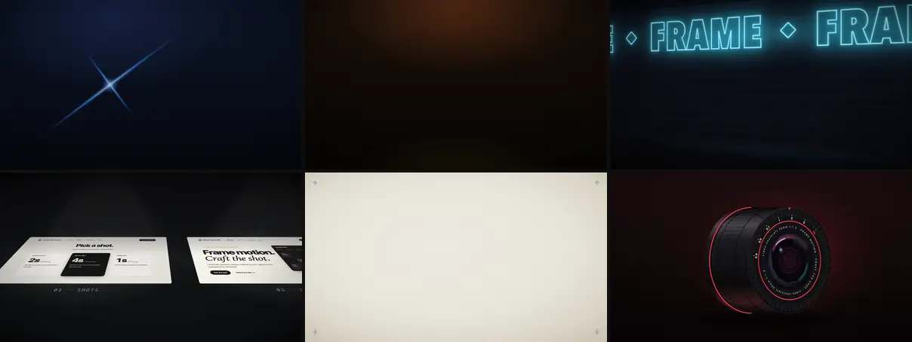

[**▶ 在 Gallery 浏览全部 150 个镜头**](https://vincentwei1021.github.io/video-shotcraft/) · [**🎬 看 Showcase 成片**](https://vincentwei1021.github.io/video-shotcraft/showcase.html)

[English](README.md) | **中文** | [日本語](README_JA.md)

[](https://github.com/Vincentwei1021/video-shotcraft/stargazers)
[](LICENSE)
[](SKILL.md)
[](SKILL.md)
[](https://atomgit.com/VincentWei/video-shotcraft)

<a href="https://trendshift.io/repositories/88911?utm_source=trendshift-badge&utm_medium=badge&utm_campaign=badge-trendshift-88911" target="_blank" rel="noopener noreferrer"></a>

</div>

## 它做什么

对 Claude Code 或 Codex 说一句「给我的产品做一支宣传片」。agent 会抓取你的真实页面，从调校好的动效配方库里挑镜头，
排分镜，用 [Remotion](https://www.remotion.dev/) 做动画，按音乐卡点剪辑，配上音效，逐帧检查，最后交给你一支
可以继续修改的 MP4。

它不是视频生成模型。每一帧都由代码基于你自己的截图和文案绘制，画面清晰、品牌准确，也能逐项修改。

- **真实产品，真实页面**：用的是你真实的界面截图，配 2.5D 运镜动起来，不是生成出来的「长得像」。
- **124 张镜头配方卡、150 个调校过的镜头**：每张卡写明什么时候用、时长、缓动和已知的坑，并附可读的 Remotion 实现。
- **交付整支成片，而不是一个片段**：分镜、字幕、踩点剪辑、电影级音效、最终验收；交付后还能在浏览器工作台里改，
  或导出剪映工程继续剪。

**流程**

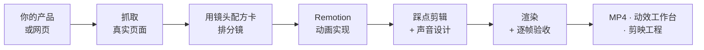

## 最近更新

> [!IMPORTANT]
> ### 🎬 2026-10 · 镜头库大改版：每个镜头重做，择优落版
> 全库 216 个 demo 镜头做了两轮改版：一轮质感打磨，一轮按发布片标准的全量重设计
> （新视觉系统 `demos/_fixtures/Look.tsx`：8 套带光的舞台配色、字号阶梯、文字揭示、光效与颗粒）。
> 随后逐个镜头三方并排（原版 / 打磨版 / 重设计版）评审、择优落版：重设计版 92 个、打磨版 50 个、
> 原版 8 个；去掉较弱的 66 个，卡库现为 **124 张卡 / 150 个镜头**，Gallery 样片全部重新渲染。
>
> demo 画面里的 logo、字标与宣传文案现在是 video-shotcraft 自己（「镜刻」标志）。标志与名字
> 统一来自 `demos/_fixtures/Brand.tsx`；用 skill 给你的产品做片时，agent 会换上你的标志、按你的产品重写文案。

- **2026-09 · [动效工作台](#动效工作台)**：成片交付后，在剪映式的浏览器编辑器里继续改。
- **2026-09 · 一键切换成片主题**：模板可在纸质 / 现代浅色 / 暗黑 / 清新鼠尾草 / 珊瑚点缀 / 柔和鸢尾 / 深海蓝 /
  黑曜紫 / 复古牛皮纸之间切换，保留文案与剪辑。[主题说明](template/THEMES.md)。
- **2026-08 · 系列新成员 [video-talkcraft](https://github.com/Vincentwei1021/video-talkcraft)**：口播视频版，
  给它口播稿和成品配音，所有动效节拍都钉在人声上（[78 条口播动效样片](https://vincentwei1021.github.io/video-talkcraft/)）。
- **2026-08 · 剪映工程导出**：成片可导出为可编辑的剪映草稿——底片按镜头切段、字幕重建为原生文本轨、
  SFX/BGM 独立音轨。Mac 剪映 11.2 实测验收（[方法](references/jianying-export.md)）。
- **2026-08 · 新增 48 张镜头配方卡**：经八轮与参考片逐帧比对评审收敛而来（[来源说明](references/shots/ATTRIBUTION.md)）。

## 安装

为 Claude Code 和 Codex 调校。最简单的方式是把仓库链接丢给你的 agent：

```text
帮我安装这个 skill：https://github.com/Vincentwei1021/video-shotcraft
```

或者用 [skills](https://skills.sh/) CLI：

```bash
npx skills add Vincentwei1021/video-shotcraft
```

或者手动安装：

```bash
git clone https://github.com/Vincentwei1021/video-shotcraft.git
cd video-shotcraft
ln -s "$(pwd)" ~/.claude/skills/video-shotcraft   # Claude Code
ln -s "$(pwd)" ~/.codex/skills/video-shotcraft    # Codex
```

国内访问 GitHub 慢的话，可以从 AtomGit 镜像克隆：
`git clone https://atomgit.com/VincentWei/video-shotcraft.git`。

## 使用

直接描述你想要的片子就行，不需要命令。

| 你说 | 会发生什么 |
|---|---|
| `用 video-shotcraft 给我的产品做一支宣传片。` | agent 先介绍 Ink Press 模板并问你是否采用，然后抓取页面、做片 |
| `用 Ink Press 模板给这个仓库做一支发布片。` | 最快的路径：把你的截图、文案和标志放进已验收的模板 |
| `用 deck-deal-flyin 和 row-embed 两张镜头卡展示这个功能。` | 你按名字点镜头（名字可以直接从 Gallery 复制） |
| `参考 spotlight-hero-card，为这个页面设计一个产品特写镜头。` | 单个镜头，按你的产品改编 |

## 你会拿到什么

| 产出 | 说明 |
|---|---|
| 成片 | `MP4`，1920×1080、30fps、h264，含音乐和音效 |
| Remotion 工程 | 整支片的源码：每个镜头都是一个 React 组件，你或 agent 都能改 |
| 动效工作台 | 交付后自动打开：多轨时间线、属性面板、变速、换镜头、导出（[详情](#动效工作台)） |
| 剪映工程 | 可选：可编辑的剪映草稿，镜头分段、字幕和音轨都能改 |

另外还附带：可复用的 Remotion 组件（2.5D 页面相机、字幕、闪切、数字滚动）、149 个音效和 5 首 BGM、
页面素材采集脚本，以及整套制作方法（素材采集、风格定调、分镜、声音设计、节奏卡点、最终验收），
见 [references/](references/pipeline.md)。

## 镜头库

124 张配方卡，分 10 类，共 150 个镜头。可以在 [Gallery](https://vincentwei1021.github.io/video-shotcraft/)
里搜索、筛选、复制卡名。

<table>
<tr>
<td align="center" width="50%"><b>开场与品牌</b> · 11 个<br>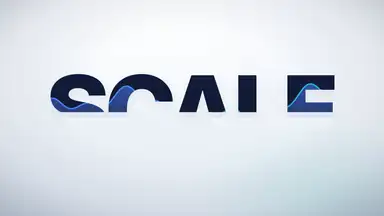<br><sub>text-as-mask：产品从标题字里透出来</sub></td>
<td align="center" width="50%"><b>运镜与空间</b> · 13 个<br>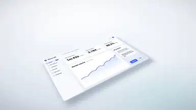<br><sub>exploded-view：页面倾斜、构件拆开</sub></td>
</tr>
<tr>
<td align="center" width="50%"><b>转场</b> · 19 个<br>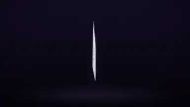<br><sub>card-flock-tumble：卡片群翻滚成标题</sub></td>
<td align="center" width="50%"><b>文字与字卡</b> · 25 个<br>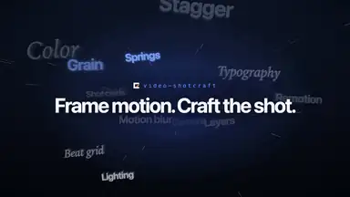<br><sub>flying-words：文字隧道收成品牌短句</sub></td>
</tr>
<tr>
<td align="center" width="50%"><b>界面登场</b> · 22 个<br><br><sub>card-stack：一叠卡片扇形发牌落位</sub></td>
<td align="center" width="50%"><b>交互演示</b> · 13 个<br>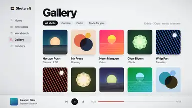<br><sub>palette-theme-ripple：新主题像波纹扫过界面</sub></td>
</tr>
<tr>
<td align="center" width="50%"><b>数据与指标</b> · 9 个<br><br><sub>axis-rescale-shock：数据冲破坐标轴</sub></td>
<td align="center" width="50%"><b>光效与强调</b> · 23 个<br>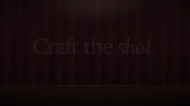<br><sub>spotlight-sweep：舞台追光找到标题</sub></td>
</tr>
<tr>
<td align="center" width="50%"><b>节奏与蒙太奇</b> · 8 个<br>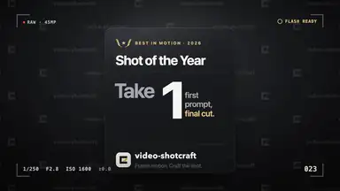<br><sub>paparazzi-flash：三次闪光、三种裁切、落在一个数字上</sub></td>
<td align="center" width="50%"><b>收尾</b> · 7 个<br>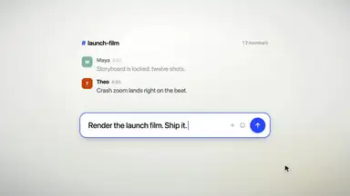<br><sub>input-morph-assemble：聊天输入框拼成标志</sub></td>
</tr>
</table>

每张卡在 `references/shots/<类别>/<卡名>.md`，对应的 Remotion 实现在 `demos/<类别>/<卡名>/`
（怎么接进你的工程见 [demos/README.md](demos/README.md)）。

## 成片模板：Ink Press（墨压）

一支已验收的完整宣传片：36.2 秒、1920×1080、30fps、10 个镜头的纸墨琥珀风，含 2.5D 真实页面运镜、字卡、转场和
配好的电影感音效。

https://github.com/user-attachments/assets/4cf5af51-98f3-4af2-8ab2-7267f470513d

▶️ [在 YouTube 观看高清版](https://youtu.be/iShab28B_ak)

对 agent 说 `用 video-shotcraft 的 Ink Press 模板给我的产品做一支宣传片。` 它会换上你的截图、文案和品牌信息，
这是最快、质量最有保障的出片路径。后续会持续加入更多模板。

## 动效工作台

交付后 skill 会在浏览器里打开一个剪映式的编辑器（`node workbench/scripts/open.mjs <工程>`）。成片按原始镜头
拆成镜头 / 转场 / 字幕 / 音效多轨；选中任意镜头可以改文案、字号和颜色，镜头可挪、可裁、可变速，镜头库里的
150 个镜头都能直接拖上轨，改完用 Remotion 导出。预览与渲染逐帧一致。

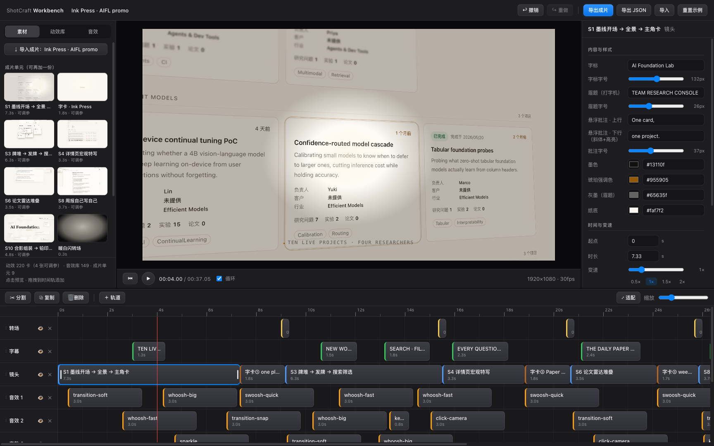

[工作台图文指南：各区域与功能](workbench/GUIDE.md) · [成片接入契约](references/workbench.md)

## 作品展示

下面这支 38 秒的 Gallery 介绍片，本身就是用这个 skill 做的：分镜、镜头实现和声音设计，全部由 agent 按库内方法完成。

https://github.com/user-attachments/assets/cba2df8a-4b2e-4247-bace-d0b1dea9c2bd

▶️ [在 YouTube 观看高清版](https://youtu.be/gcVvRM_P3SM)

**投稿你的作品**：用 video-shotcraft 做了片子？用 Showcase 投稿表单
[提交](https://github.com/Vincentwei1021/video-shotcraft/issues/new?template=showcase.yml)，审核通过后会出现在
[Showcase 页面](https://vincentwei1021.github.io/video-shotcraft/showcase.html)。

## 环境要求

| 需要 | 用途 |
|---|---|
| Node.js 和 npm | Remotion 渲染、成片模板和动效工作台 |
| ffmpeg / ffprobe | 抽帧检查与最终验收 |
| [uv](https://docs.astral.sh/uv/) | 只在分析 BGM 节拍时用（跑一次性的 Python 脚本） |
| puppeteer | 只在抓取页面时用，采集脚本会按需安装 |

Remotion 首次渲染时会自动下载自己的无头 Chrome。已在 macOS 上测试，Linux 参考下面的说明。

<details>
<summary><b>Linux 服务器 / CI 注意事项</b></summary>

在无显示器的 Linux 服务器上渲染（实测环境：2 核、Node 22）会遇到三个坑，各加一个参数就能解决：

1. **并发上限**：低核机器上 `remotion still/render` 会报 "Maximum for --concurrency is 2"。加 `--concurrency=1`。
2. **旧版 headless 被移除**：新版 Chrome/Chromium 删了旧 headless 模式，让 Remotion 指向系统 chromium 会启动失败。
   改用 chrome-headless-shell 二进制，不要用完整版 Chrome。
3. **CDN 访问不了**：remotion.media 访问不了时（国内常见），headless-shell 自动下载会失败。
   用 `--browser-executable=<本地 chrome-headless-shell 路径>` 指定本地二进制。

加上这三个参数后，内置模板即可正常渲染。

</details>

<details>
<summary><b>项目结构</b></summary>

```text
video-shotcraft/
├── SKILL.md                 # Agent 使用入口与核心制作规则
├── references/
│   ├── pipeline.md          # 完整制作流水线
│   ├── shots/               # 124 张镜头配方卡，按功能分 10 类
│   ├── sequences/           # 可复用的全片结构与桥段模板
│   ├── aesthetic-rules.md   # 视觉验收准则
│   ├── music-beat-sync.md   # BGM 节奏分析与卡点方法
│   ├── sound-design.md      # 声音设计方法与判例
│   ├── jianying-export.md   # 剪映工程导出方法
│   └── workbench.md         # 动效工作台：成片接入契约 + 可编辑性规则
├── demos/                   # 镜头卡的 Remotion 参考实现（同类别目录）
├── gallery/                 # 在线样片画廊的静态站点
├── template/                # 可直接运行的完整成片模板
├── jianying-export/         # 剪映草稿安装模块（Mac 实测 / Windows 未验证）
├── workbench/               # 交付后的动效工作台（Vite + Remotion Player）
└── assets/
    ├── lib/                 # 可复制使用的 Remotion 组件
    ├── scripts/             # 页面素材采集脚本
    └── audio/               # 音频资产
        ├── bgm/             # 5 首 BGM 备选
        └── sfx/<类别>/      # 149 个音效，按场景分 16 类
```

完整工作流和实现要求见 [SKILL.md](SKILL.md)、[制作流水线](references/pipeline.md) 与
[视觉验收准则](references/aesthetic-rules.md)。

</details>

## 音频与素材

音效按场景 / 材质分 16 类（`transition` `impact` `riser` `camera` `ui` `text` `paper` `film` `light` `data`
`scifi` `mech` `glass` `fluid` `crowd` `counter`），找音先定类别再挑音色。类别索引与逐文件用途见
[sound-design.md](references/sound-design.md)，来源与许可见 [ATTRIBUTION.md](assets/audio/ATTRIBUTION.md)。

模板内的产品截图为演示素材。对外发布成片前，请替换为你自己产品的截图，并确认其中的数据、客户信息和个人信息
是否需要脱敏。

## 许可

- 代码与文档：[Apache-2.0](LICENSE)。
- `assets/audio/` 下的音频：各自按其授权使用，见 [ATTRIBUTION.md](assets/audio/ATTRIBUTION.md)。
- [Remotion](https://www.remotion.dev/) 有自己的[许可协议](https://github.com/remotion-dev/remotion/blob/main/LICENSE.md)：
  个人与小团队免费，公司可能需要付费许可。

## 致谢

本库中许多镜头配方源自对优秀官方产品宣传片动效语言的研究学习，包括 **ClickUp、Perplexity、Slack、Notion、
Figma、Framer、Bear、Raycast、Pitch、Miro、Superhuman、Loom** 等产品的宣传片。镜头卡记录的是从零重新实现的
动效技法（时序、缓动、编排），仓库中不包含上述影片的任何素材、画面或品牌资产。所有商标归各自所有者所有，
上述公司与本项目无关联，亦未对本项目背书。

也感谢 **[Remotion](https://www.remotion.dev/)**——驱动本库全部 demo 与模板的 React 视频框架；
**[Mixkit](https://mixkit.co/)**——库内音效与音乐素材的来源（免费授权）；游戏手感与动画社区的公开方法论，
多张镜头卡受其启发；以及 **Claude Code**——本库自身的构建、迭代与验收都由它完成，用的正是这个 skill 教的工作流。

## 关注我

<p>
  <a href="https://x.com/VincentWei93"></a>
  <a href="https://www.douyin.com/user/MS4wLjABAAAAK1pkjBxilk2Oi_9h_vFyD-lTAu9CTlvhmOtkosDvvxg"></a>
  <a href="https://xhslink.cn/m/At9iP2d5C1V"></a>
</p>

## Star 历史

<a href="https://www.star-history.com/?repos=Vincentwei1021%2Fvideo-shotcraft&type=date&legend=top-left">
  <picture>
    <source media="(prefers-color-scheme: dark)" srcset="https://api.star-history.com/chart?repos=Vincentwei1021/video-shotcraft&type=date&theme=dark&legend=top-left&sealed_token=DQ8_yn0k8in6tP80CRd9Ghuk1fcdEW7poFh9ticGB3wMNO-E_i6g51sUiQWCAQYP0u0bjRweuIfGoRS8FnrIz86oFp1lcl5zu2vrEJrQOoNvwdUSwmm8XNPkAiln1o-EBAX0uU8k6ReIlSRufGLqpoxsWshMSZ9mmok6ox5XXIUO77b7zOgp2yRIH6yR" />
    <source media="(prefers-color-scheme: light)" srcset="https://api.star-history.com/chart?repos=Vincentwei1021/video-shotcraft&type=date&legend=top-left&sealed_token=DQ8_yn0k8in6tP80CRd9Ghuk1fcdEW7poFh9ticGB3wMNO-E_i6g51sUiQWCAQYP0u0bjRweuIfGoRS8FnrIz86oFp1lcl5zu2vrEJrQOoNvwdUSwmm8XNPkAiln1o-EBAX0uU8k6ReIlSRufGLqpoxsWshMSZ9mmok6ox5XXIUO77b7zOgp2yRIH6yR" />
    
  </picture>
</a>
