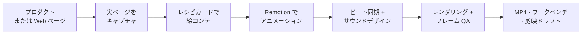

<div align="center">

<picture>
  <source media="(prefers-color-scheme: dark)" srcset="./assets/brand/logo-mark-reverse.svg">
  <source media="(prefers-color-scheme: light)" srcset="./assets/brand/logo-mark.svg">
  
</picture>

# video-shotcraft

**Frame motion. Craft the shot.**

プロダクトをエージェントに渡すだけで、映画のようなプロモーション映像が返ってきます。


[**▶ Gallery で 150 ショットをすべて見る**](https://vincentwei1021.github.io/video-shotcraft/) · [**🎬 Showcase の作品を見る**](https://vincentwei1021.github.io/video-shotcraft/showcase.html)

[English](README.md) | [中文](README_CN.md) | **日本語**

[](https://github.com/Vincentwei1021/video-shotcraft/stargazers)
[](LICENSE)
[](SKILL.md)
[](SKILL.md)
[](https://atomgit.com/VincentWei/video-shotcraft)

<a href="https://trendshift.io/repositories/88911?utm_source=trendshift-badge&utm_medium=badge&utm_campaign=badge-trendshift-88911" target="_blank" rel="noopener noreferrer"></a>

</div>

## できること

Claude Code や Codex に「プロダクトのプロモーション動画を作って」と頼むだけ。エージェントが実際のページを
キャプチャし、調整済みのモーションレシピからショットを選んで絵コンテを組み、[Remotion](https://www.remotion.dev/)
でアニメーションを作り、音楽のビートに合わせてカットし、サウンドデザインを加え、全フレームを確認して、
そのまま編集を続けられる MP4 を納品します。

動画生成モデルではありません。すべてのフレームはあなた自身のスクリーンショットとコピーからコードで描かれるので、
くっきりとブランドに忠実で、細部まで編集できます。

- **本物のプロダクト、本物のページ**：実際の UI をキャプチャし、2.5D カメラワークで動かします。生成された「似たもの」ではありません。
- **ショットレシピカード 124 枚、調整済みショット 150 本**：各カードに使いどころ・尺・イージング・既知の落とし穴を
  記し、読める Remotion 実装を同梱しています。
- **クリップではなく、完成した映像**：絵コンテ、字幕、ビート同期カット、映画品質の SFX、最終 QA まで。
  納品後はブラウザのワークベンチで編集を続けたり、剪映（CapCut 中国版）に書き出したりできます。

**仕組み**



## 最新情報

> [!IMPORTANT]
> ### 🎬 2026-10 · ライブラリ大改修：全ショットを作り直し、ベストな版を採用
> 216 本すべての demo ショットに 2 段階の改修を実施しました。質感の磨き込みと、
> ローンチ映像クラスへの全面リデザインです（新しいビジュアルシステム
> `demos/_fixtures/Look.tsx`：ライティング付きの 8 種類のステージ配色、文字サイズの階層、
> テキストリビール、光とグレイン）。その後、ショットごとにオリジナル / 磨き込み版 /
> リデザイン版を並べて比較し、最も良い版を採用しました（リデザイン 92 本、磨き込み 50 本、
> オリジナル 8 本）。弱い 66 本は引退し、ライブラリは **124 カード / 150 ショット**に。
> Gallery のプレビューもすべて再レンダリングしています。
>
> demo の画面に出るロゴ・ワードマーク・プロモーションコピーは video-shotcraft 自身のもの
> （「镜刻」マーク）になりました。マークと名前は `demos/_fixtures/Brand.tsx` に集約しており、
> skill であなたのプロダクトの映像を作るときは、エージェントがあなたのロゴに差し替え、
> コピーもプロダクトに合わせて書き直します。

- **2026-09 · [モーションワークベンチ](#モーションワークベンチ)**：納品した映像を CapCut 風のブラウザエディタで編集し続けられます。
- **2026-09 · ワンクリックでテーマ切り替え**：テンプレートを 9 種類のルック（Ink Press、Modern Light、Midnight、Sage、
  Coral、Iris、Deep Ocean、Obsidian Violet、Vintage Kraft）に切り替えても編集内容はそのまま。[テーマガイド](template/THEMES.md)。
- **2026-08 · シリーズ新作 [video-talkcraft](https://github.com/Vincentwei1021/video-talkcraft)**：ナレーション動画版。
  原稿とボイスオーバーを渡すと、すべてのモーションが音声にロックされます
  （[78 本のナレーション用プレビュー](https://vincentwei1021.github.io/video-talkcraft/)）。
- **2026-08 · 剪映（CapCut 中国版）書き出し**：完成映像を編集可能な剪映ドラフトに。ショット単位のクリップ、
  ネイティブ字幕トラック、独立した SFX/BGM トラック。macOS 版剪映 11.2 で検証済み（[ガイド](references/jianying-export.md)）。
- **2026-08 · ショットレシピカード 48 枚を追加**：参照映像とのフレーム単位比較レビューを 8 ラウンド重ねて厳選
  （[出典メモ](references/shots/ATTRIBUTION.md)）。

## インストール

Claude Code と Codex 向けに作り、調整しています。いちばん簡単なのは、エージェントにリンクを渡すことです：

```text
このスキルをインストールして：https://github.com/Vincentwei1021/video-shotcraft
```

[skills](https://skills.sh/) CLI でも：

```bash
npx skills add Vincentwei1021/video-shotcraft
```

手動の場合：

```bash
git clone https://github.com/Vincentwei1021/video-shotcraft.git
cd video-shotcraft
ln -s "$(pwd)" ~/.claude/skills/video-shotcraft   # Claude Code
ln -s "$(pwd)" ~/.codex/skills/video-shotcraft    # Codex
```

## 使い方

作りたい映像を説明するだけ。コマンドは不要です。

| 言うこと | 起きること |
|---|---|
| `video-shotcraft でプロダクトのプロモーション動画を作って。` | エージェントがまず Ink Press テンプレートを紹介して使うか確認し、ページをキャプチャして映像を作ります |
| `Ink Press テンプレートでこのリポジトリのローンチ動画を作って。` | 最速ルート：検証済みテンプレートにあなたのスクリーンショット・コピー・ロゴを入れます |
| `deck-deal-flyin と row-embed のショットカードでこの機能を紹介して。` | ショットを名前で指定（名前は Gallery からそのままコピーできます） |
| `spotlight-hero-card を参考に、このページの製品クローズアップを作って。` | 1 ショットをあなたのプロダクト向けにアレンジ |

## 納品物

| 成果物 | 内容 |
|---|---|
| 完成映像 | `MP4`、1920×1080、30fps、h264、音楽とサウンドデザイン付き |
| Remotion プロジェクト | 映像のソース一式。各ショットは React コンポーネントで、あなたもエージェントも変更できます |
| モーションワークベンチ | 納品後に自動で開く：トラック、インスペクタ、速度変更、ショット差し替え、書き出し（[詳細](#モーションワークベンチ)） |
| 剪映ドラフト | 任意：ショット単位のクリップ・字幕・音声トラックを編集できる剪映プロジェクト |

ほかにも、再利用できる Remotion コンポーネント（2.5D ページカメラ、字幕、フラッシュカット、数字ロール）、
SFX 149 種と BGM 5 曲、ページキャプチャスクリプト、そして制作手法そのもの（素材キャプチャ、ビジュアルの方向付け、
絵コンテ、サウンドデザイン、ビート同期、最終 QA）を [references/](references/pipeline.md) に収録しています。

## ショットライブラリ

レシピカード 124 枚、10 カテゴリ、計 150 ショット。[Gallery](https://vincentwei1021.github.io/video-shotcraft/)
で検索・絞り込み・カード名のコピーができます。

<table>
<tr>
<td align="center" width="50%"><b>オープニングとブランド</b> · 11 本<br><br><sub>text-as-mask：タイトルの文字からプロダクトが見える</sub></td>
<td align="center" width="50%"><b>カメラ</b> · 13 本<br><br><sub>exploded-view：ページが傾き、分解する</sub></td>
</tr>
<tr>
<td align="center" width="50%"><b>トランジション</b> · 19 本<br><br><sub>card-flock-tumble：カードの群れが見出しになる</sub></td>
<td align="center" width="50%"><b>タイポグラフィ</b> · 25 本<br><br><sub>flying-words：文字のトンネルがモットーに収束</sub></td>
</tr>
<tr>
<td align="center" width="50%"><b>UI 登場</b> · 22 本<br><br><sub>card-stack：カードの束が扇状に配られて着地</sub></td>
<td align="center" width="50%"><b>インタラクション</b> · 13 本<br><br><sub>palette-theme-ripple：新テーマが波紋のように広がる</sub></td>
</tr>
<tr>
<td align="center" width="50%"><b>データ</b> · 9 本<br><br><sub>axis-rescale-shock：急上昇が軸を突き破る</sub></td>
<td align="center" width="50%"><b>光と強調</b> · 23 本<br><br><sub>spotlight-sweep：舞台の光がタイトルを見つける</sub></td>
</tr>
<tr>
<td align="center" width="50%"><b>リズム</b> · 8 本<br><br><sub>paparazzi-flash：3 回のフラッシュ、3 つの構図、ひとつの数字</sub></td>
<td align="center" width="50%"><b>アウトロ</b> · 7 本<br><br><sub>input-morph-assemble：チャット入力欄がロゴを組み立てる</sub></td>
</tr>
</table>

各カードは `references/shots/<カテゴリ>/<カード名>.md`、Remotion 実装は `demos/<カテゴリ>/<カード名>/` にあります
（プロジェクトへの組み込み方は [demos/README.md](demos/README.md) を参照）。

## 動画テンプレート：Ink Press

検証済みの完成プロモーション映像：36.2 秒、1920×1080、30fps、紙・墨・琥珀スタイルの 10 ショット。
実ページの 2.5D カメラワーク、タイトルカード、トランジション、映画風 SFX を作り込み済みです。

https://github.com/user-attachments/assets/4cf5af51-98f3-4af2-8ab2-7267f470513d

▶️ [YouTube で HD 版を見る](https://youtu.be/iShab28B_ak)

エージェントに `video-shotcraft の Ink Press テンプレートでプロダクトのプロモーション動画を作って。` と伝えれば、
スクリーンショット・コピー・ブランドを差し替えて同じ品質を再現します。完成映像へのいちばん速く確実なルートです。
テンプレートは今後も追加予定です。

## モーションワークベンチ

納品後、skill がブラウザで CapCut 風のエディタを開きます（`node workbench/scripts/open.mjs <project>`）。
映像は元の構成どおりにショット / トランジション / 字幕 / SFX のトラックへ分解され、任意のショットを選んで
文言・フォントサイズ・色を編集、クリップの移動・トリム・速度変更、ライブラリの 150 ショットのドラッグ追加、
Remotion での書き出しができます。プレビューとレンダリングはフレーム単位で一致します。


[ワークベンチガイド（各パネルをスクリーンショット付きで）](workbench/GUIDE.md)（中国語）·
[連携コントラクト](references/workbench.md)

## ショーケース

下の 38 秒の Gallery 紹介映像も、この skill で作りました。絵コンテ、ショット実装、サウンドデザインまで、
すべてエージェントがライブラリの手法どおりに仕上げています。

https://github.com/user-attachments/assets/cba2df8a-4b2e-4247-bace-d0b1dea9c2bd

▶️ [YouTube で HD 版を見る](https://youtu.be/gcVvRM_P3SM)

**作品を投稿**：video-shotcraft で映像を作ったら、Showcase の投稿フォームから
[提出](https://github.com/Vincentwei1021/video-shotcraft/issues/new?template=showcase.yml)してください。審査後、
[Showcase ページ](https://vincentwei1021.github.io/video-shotcraft/showcase.html)に掲載されます。

## 動作環境

| 必要なもの | 用途 |
|---|---|
| Node.js と npm | Remotion のレンダリング、テンプレート、ワークベンチ |
| ffmpeg / ffprobe | フレーム確認と最終 QA |
| [uv](https://docs.astral.sh/uv/) | BGM のビート解析のみ（使い捨ての Python スクリプトを実行） |
| puppeteer | ページキャプチャのみ。キャプチャスクリプトが必要に応じてインストール |

Remotion は初回レンダリング時にヘッドレス Chrome を自動でダウンロードします。macOS で検証済み、Linux は下の注意点を参照してください。

<details>
<summary><b>ヘッドレス Linux / CI の注意点</b></summary>

ディスプレイのない Linux サーバー（検証環境：2 コア、Node 22）でレンダリングすると、3 つの壁にぶつかります：

1. **並列数の上限**：低コアのマシンでは `remotion still/render` が "Maximum for --concurrency is 2" で失敗します。
   `--concurrency=1` を指定してください。
2. **旧ヘッドレスモードの廃止**：最近の Chrome/Chromium は旧ヘッドレスモードを削除したため、システムの Chromium を
   指定すると起動に失敗します。フル版 Chrome ではなく chrome-headless-shell を使ってください。
3. **CDN に届かない**：remotion.media にアクセスできない環境では、headless-shell の自動ダウンロードが失敗します。
   `--browser-executable=<ローカルの chrome-headless-shell のパス>` を指定してください。

この 3 つを指定すれば、同梱テンプレートのレンダリングは動きます。

</details>

<details>
<summary><b>リポジトリ構成</b></summary>

```text
video-shotcraft/
├── SKILL.md                 # エージェントの入口と制作の基本ルール
├── references/
│   ├── pipeline.md          # 制作ワークフロー全体
│   ├── shots/               # 10 カテゴリ 124 枚のショットレシピカード
│   ├── sequences/           # 再利用できる映像全体の構成とシーケンス
│   ├── aesthetic-rules.md   # ビジュアル QA の基準
│   ├── music-beat-sync.md   # BGM 解析とビート同期の手法
│   ├── sound-design.md      # サウンドデザインの指針と事例
│   ├── jianying-export.md   # 剪映（CapCut 中国版）書き出しガイド
│   └── workbench.md         # ワークベンチ：マニフェスト契約と編集可能性のルール
├── demos/                   # Remotion 参照実装（同じカテゴリ構成）
├── gallery/                 # 静的なモーションプレビュー Gallery
├── template/                # そのまま動く完成映像テンプレート
├── jianying-export/         # 剪映ドラフトのインストーラ（mac 検証済み / win 未検証）
├── workbench/               # 納品後のモーションワークベンチ（Vite + Remotion Player）
└── assets/
    ├── lib/                 # 再利用できる Remotion コンポーネント
    ├── scripts/             # ページ素材のキャプチャスクリプト
    └── audio/               # 音声素材
        ├── bgm/             # BGM 5 曲
        └── sfx/<category>/  # 16 シーンカテゴリ、149 種の SFX
```

ワークフロー全体は [SKILL.md](SKILL.md)、[制作パイプライン](references/pipeline.md)、
[ビジュアル QA 基準](references/aesthetic-rules.md) を参照してください。

</details>

## 音声と素材

SFX はシーン / 素材ごとに 16 カテゴリ（`transition` `impact` `riser` `camera` `ui` `text` `paper` `film` `light`
`data` `scifi` `mech` `glass` `fluid` `crowd` `counter`）に分かれています。まずカテゴリを決めてから音色を選んでください。
索引とファイルごとの用途は [sound-design.md](references/sound-design.md)、出典とライセンスは
[ATTRIBUTION.md](assets/audio/ATTRIBUTION.md) にあります。

テンプレートに同梱のプロダクトスクリーンショットはデモ用素材です。公開前に対象プロダクトのスクリーンショットに
差し替え、プロダクト・顧客・個人のデータを匿名化する必要がないか確認してください。

## ライセンス

- コードとドキュメント：[Apache-2.0](LICENSE)。
- `assets/audio/` の音声：各ファイルのライセンスに従います。[ATTRIBUTION.md](assets/audio/ATTRIBUTION.md) を参照。
- [Remotion](https://www.remotion.dev/) には独自の[ライセンス](https://github.com/remotion-dev/remotion/blob/main/LICENSE.md)があります：
  個人と小規模チームは無料、企業は有料ライセンスが必要な場合があります。

## 謝辞

ライブラリの多くのレシピは、優れた公式プロダクト映像のモーション言語を研究して抽出しました。**ClickUp、Perplexity、
Slack、Notion、Figma、Framer、Bear、Raycast、Pitch、Miro、Superhuman、Loom** などのプロモーション映像です。
カードに記録しているのはゼロから再実装した技法（タイミング、イージング、振り付け）で、これらの映像の素材・
アートワーク・ブランド資産はリポジトリに含まれていません。商標はそれぞれの所有者に帰属し、これらの企業は
本プロジェクトと提携・推薦の関係にありません。

また、すべての demo とテンプレートを支える **[Remotion](https://www.remotion.dev/)**、同梱の SFX と音楽の提供元
**[Mixkit](https://mixkit.co/)**（無料ライセンス）、いくつものカードに影響を与えたゲームフィールとアニメーションの
コミュニティ、そしてこの skill が教えるのと同じワークフローでライブラリの構築・改善・QA を行った
**Claude Code** に感謝します。

## フォロー

<p>
  <a href="https://x.com/VincentWei93"></a>
  <a href="https://www.douyin.com/user/MS4wLjABAAAAK1pkjBxilk2Oi_9h_vFyD-lTAu9CTlvhmOtkosDvvxg"></a>
  <a href="https://xhslink.cn/m/At9iP2d5C1V"></a>
</p>

## Star の推移

<a href="https://www.star-history.com/?repos=Vincentwei1021%2Fvideo-shotcraft&type=date&legend=top-left">
  <picture>
    <source media="(prefers-color-scheme: dark)" srcset="https://api.star-history.com/chart?repos=Vincentwei1021/video-shotcraft&type=date&theme=dark&legend=top-left&sealed_token=DQ8_yn0k8in6tP80CRd9Ghuk1fcdEW7poFh9ticGB3wMNO-E_i6g51sUiQWCAQYP0u0bjRweuIfGoRS8FnrIz86oFp1lcl5zu2vrEJrQOoNvwdUSwmm8XNPkAiln1o-EBAX0uU8k6ReIlSRufGLqpoxsWshMSZ9mmok6ox5XXIUO77b7zOgp2yRIH6yR" />
    <source media="(prefers-color-scheme: light)" srcset="https://api.star-history.com/chart?repos=Vincentwei1021/video-shotcraft&type=date&legend=top-left&sealed_token=DQ8_yn0k8in6tP80CRd9Ghuk1fcdEW7poFh9ticGB3wMNO-E_i6g51sUiQWCAQYP0u0bjRweuIfGoRS8FnrIz86oFp1lcl5zu2vrEJrQOoNvwdUSwmm8XNPkAiln1o-EBAX0uU8k6ReIlSRufGLqpoxsWshMSZ9mmok6ox5XXIUO77b7zOgp2yRIH6yR" />
    
  </picture>
</a>
